# Analyzing arrests

This section reviews particular passages in stories and studies that you can replicate in your own area:

* The Deportation Data Project's study, "[Immigration Enforcement in the First Nine Months of the Second Trump Administration](https://deportationdata.org/analysis/immigration-enforcement-first-nine-months-trump.html)", by Graeme Blair and David Hausman. This analysis uses a subset of arrests, but the basic patterns still hold whether or not you follow their methodology.

* The Colorado Sun's deep dive into the profile of arrests in their area:  "[Ice arrested more than 3,500 people in Colorado in 2025 - including babies and the elderly](https://coloradosun.com/2025/12/31/ice-arrests-2025-data-deportation-data-project/)," by Taylor Dolven and Sandra Fish, and an earlier story on the [criminal histories in Colorado and Wyoming](https://coloradosun.com/2025/07/18/ice-arrests-colorado-wyoming-no-criminal-history/) published with WyoFile.

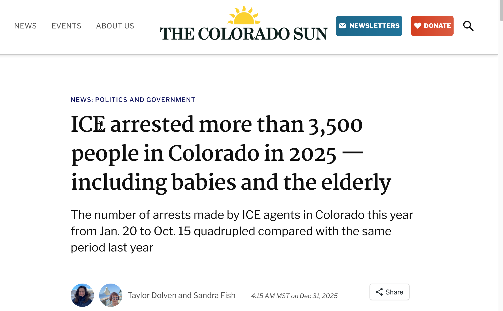{width=65% fig-align="center"}

* The Washington Post's [comprehensive view of street arrests](https://wapo.st/46wte1r) (gift link), which go back to 2008. This analysis will be a shortened version of it, but the growth in "at-large" arrests is one of the most visible pieces of the enforcement surges.

You can replicate these analyses using these three methods:

* Recoding data into the exact categories you need, such as the timing categories shown in the last chapter.

* Filtering the data to remove items you don't want to see. If you want to limit your work to just arrests since Inauguration Day 2025, consider filtering for those dates and copying the results to a new sheet before you get started.

* Creating one- or two-way pivot tables, with percentages. This guide assumes you know how to start making a pivot table. If you don't, review the process in the Appendix in this guide.

Whenever you do your analysis, consider comparing your answers to those found in other stories and studies. Big differences could reflect your area's uniqueness, but they could also signal major errors.

## Criminal histories

The New York Times, Stateline and the Colorado Sun have gone beyond knowing that most people arrested in 2025 lacked a known criminal conviction. They also looked at the charges and the proportion that were violent. The enhanced data from BLN includes charges and crime categories derived from other tables in the data collection.

Here's what the Colorado Sun and WyoFile said, based on data through July 2025 :

::: blockquote

Most people arrested by U.S. Immigration and Customs Enforcement agents between Jan. 20 and June 26 of this year in Colorado and Wyoming did not have any criminal convictions, according to ICE data released over the last few weeks. Among those arrested who had a conviction at the time of their arrest, the most serious crime is most often noted by ICE as drunken driving in both Colorado and Wyoming, the data shows.

:::

Below are a few ways you can look at the criminal background of people arrested in your area.

All of the examples shown here are for the Los Angeles area of responsibility through October 15, 2025.

### Criminality at the time of apprehension:

The original data includes a single indicator for "criminality" at the time of arrest. It includes no detail on what those crimes were.

Look at this very general categorization as a first step by creating a simple pivot table of the column called `arrest_criminality`:

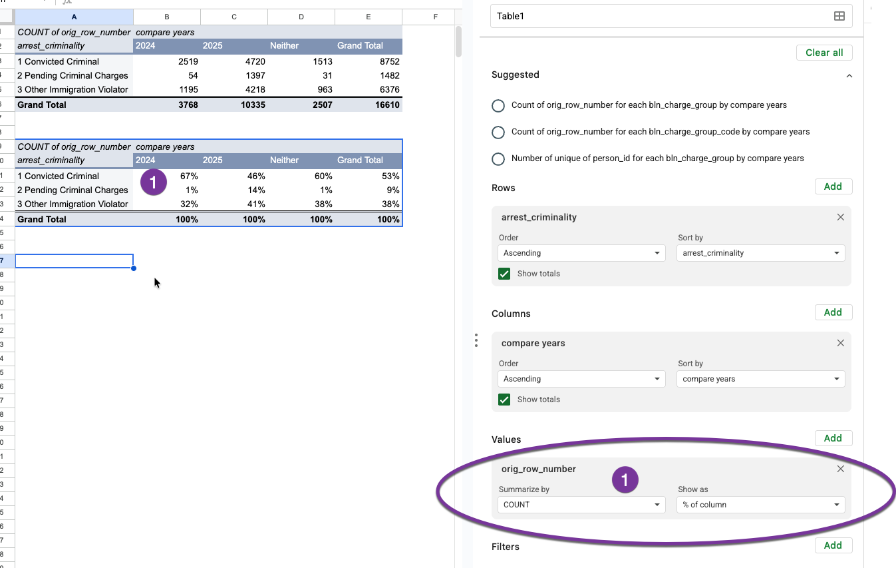{width=80%}

("Other immigration violator" is the way that ICE says that someone has no pending charges or convictions -- everyone they arrest is accused of violating immigration rules.)

This analysis shows how important it is for you to distinguish patterns before and after the second Trump inauguration. In the Los Angeles area, most arrests were of people with criminal convictions since 2023, but the 2025 data shows a different pattern.

While not exactly the same, these numbers for the Los Angeles area are in rough agreement with the data from elsewhere, including the Colorado story. It suggests that ICE thinks there are pending criminal charges against many more immigrants in the previous year, but many fewer have actual convictions. This is most likely because ICE is more aggressively arresting people released from local jails by checking book-ins for fingerprint matches against immigration court orders. These detainers aren't necessarily honored by local authorities, but some reports have suggested ICE agents linger outside jails waiting for people to be released.

### Violent criminal history

BLN has added a "special" code to the data, referring to special categories of criminal convictions. Here's what they look like for the Los Angeles area when combined with the criminality code. (The empty charge type means there is no special code -- it's all other crimes.)

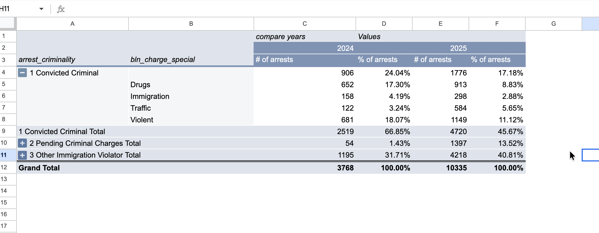{fig-alt="Criminality by type of crime" width=80%}

This shows the proportion of arrests of people with violent criminal histories has fallen, to 11 percent, in the Los Angeles area. This is higher than in other parts of the country.

### Most frequent charges

The Colorado Sun / WyoFile data through June surprisingly showed that the most frequent charge was drunken driving. Here's what the charges look like in Los Angeles, through Oct. 15. (Note that the `Filter` section of the pivot table setup is used instead of comparing the two periods in this chart.)

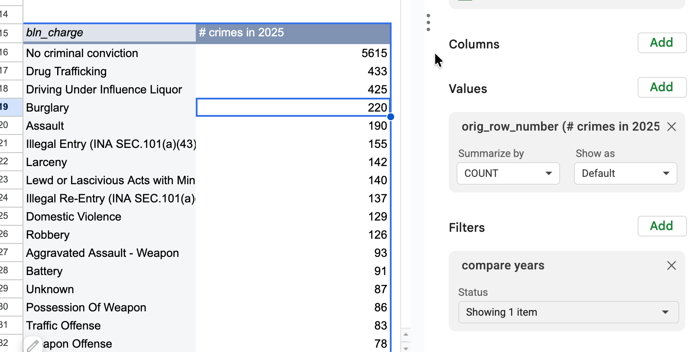{fig-alt="Most common crime charge in LA is drug trafficking followed by DUI" width=80%}

You can see that you probably want to combine similar types of crimes rather than counting DUI and Traffice Offense as separate charge. You can do this by using another BLN-added column `bln_charge_group`, which combines crimes based on their standard FBI codes into more general groupings. For instance, all homicides are grouped together instead of being broken out by a specific type. Here's a portion of the Los Angeles data showing the different ways you can look at homicides:

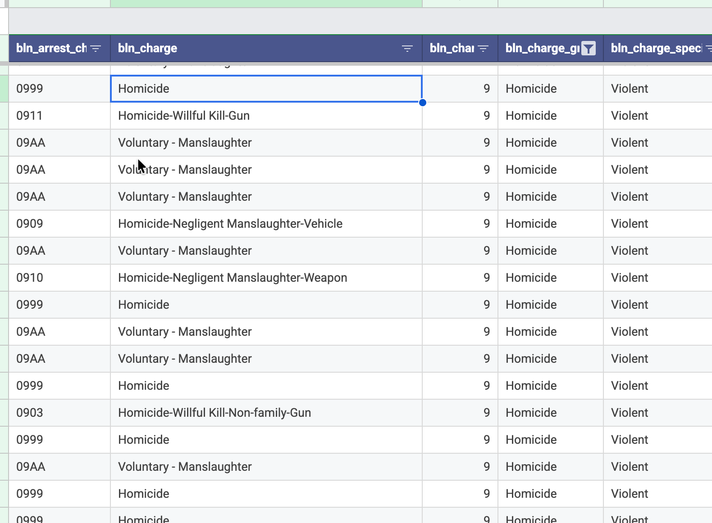{width=90%}

Here is the pivot table that shows these more general charge groups:

## Custodial vs. at-large arrests

BLN has used Homeland Security's definitions of the apprehension method, distinguishing between what they call "custodial" and "at-large" arrests. You can think of at-large arrests the same way some people have written about street arrests, or arrests that happen in the community. These are any arrests made that was not part of a transfer from a detention center, jail or prison. One marked difference from previous years is that ICE is making many more of these arrests as shown in this weekly chart from the DDP paper.

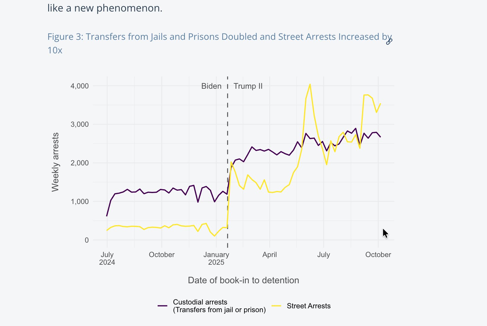{width=80% fig-align="center"}

Here's what a similar chart of the Los Angeles data would look like, based on a pivot table by month:

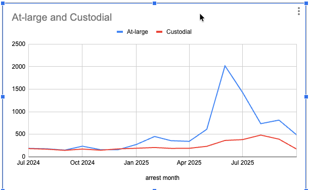

The overall number of arrests didn't increase as much in Los Angeles, partly because California does not honor the detainers that lead to custodial arrests. But the spike in at-large, or street arrests, is noticeable during the surge over the summer of 2025 in Southern California.

::: callout-warning

## People vs. arrest counts

People are duplicated in the arrest data when they have been arrested more than once. You can handle this in several ways. The easiest is to ignore it, and use careful language to distinguish between people and arrests.

But if you want to make sure you're not double-counting anyone, you can use the `bln_person_id` as a way to count "unique" values. This makes sure no one is counted twice in the same sentence, but can lead to confusing totals -- the number of "people arrested" will differ between the total, the total for a year, or the total for a month.

Here's how you would avoid double-counting people, and how it changes the totals:

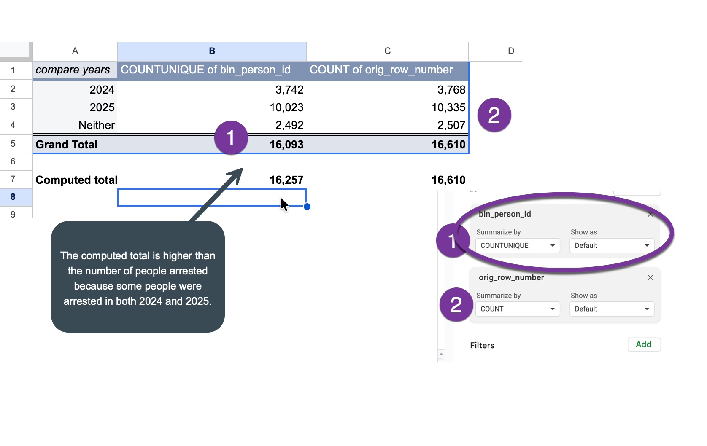{width=80%}

:::

## Countries and ages

Here's what the Colorado Sun wrote about the youngest person arrested since January 2025:

::: blockquote

Among the youngest people arrested in Colorado was a baby girl born in 2024, the data shows, with Mexican citizenship. ICE arrested her July 30 in the Denver area and deported her Aug. 8 to Venezuela, according to the data.

:::

To find the same thing for your area:

1. Filter for dates since Jan. 20, 2025
2. Sort the table by birth year, in descending order
3. Look across the table to see what happened to that toddler

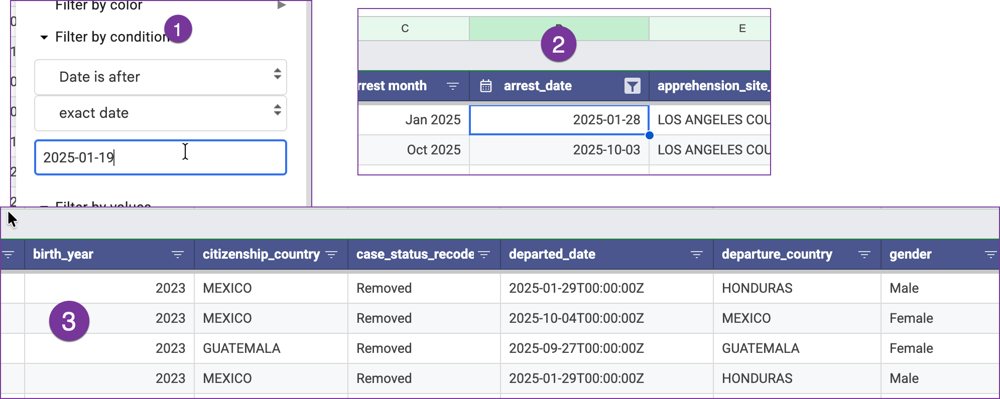

Here, the  youngest is a Mexican boy born in 2023, arrested on January 28 and removed the next day to Honduras, according to the data.

You can reverse the sorting and filter for "No criminal conviction" to find the oldest person without a criminal conviction - a Mexican man in his late 70s, arrested in public in September, who left voluntarily on the same day.

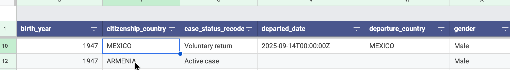

Consider filtering by country if you are interested in people from a particular country -- say, Venezuela.

::: callout-tip

## Pro-tip: Remove filters

Remove  all filters anytime you start a new analysis -- it's easy to get confused about what, exactly, you're looking at in a large spreadsheet. Choose the menu item Data -> Remove Filter to begin, then re-set your filter for arrests since Jan. 20.

:::

::: callout-tip

## Pro-tip: Save filter views

When you filter, the bottom right corner will display how many arrests are included in your current view. Save this view for the future by choosing the menu item Data, Save as Filter View, and give it a name:

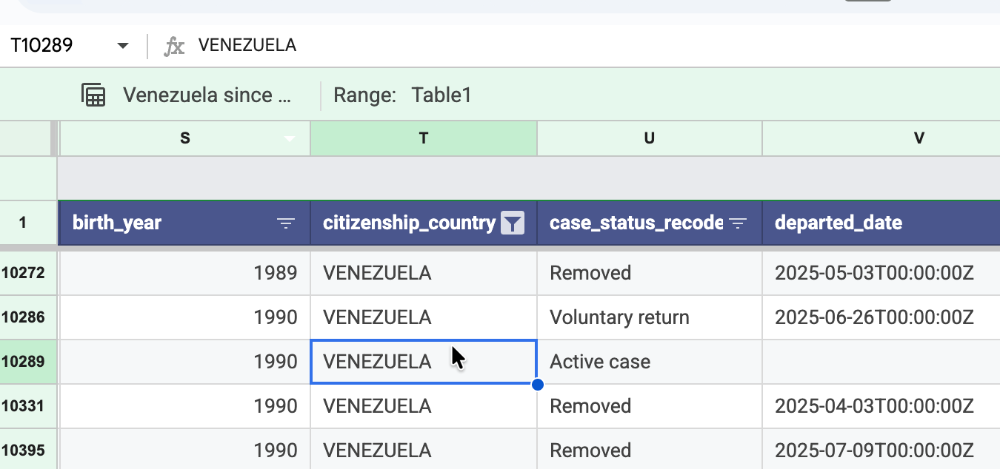{width=80% fig-align="center"}

When you close that view, the filter is turned off and you can start over.

:::

## Enforcement raids

You may have heard of a raid or a group of arrests at one time in your area -- a workplace raid like the one at the Hyundai plant in Georgia, or a group of soccer fans arrested as they exited an arena. Consider looking for these in the arrest data, then following up with whatever you can find using your usual reporting methods. That's what the Colorado Sun did, in order to get this lede:

::: blockquote

On just one Sunday in April, immigration officers arrested at least 72 people in Colorado, data from U.S. Immigration and Customs Enforcement shows, the busiest day for immigration enforcement in the state so far since President Donald Trump took office in January.

That day, federal agents from several agencies raided a Colorado Springs nightclub, arresting dozens of people they suspected of being in the country illegally.

“Colorado Springs is waking up to a safer community today,” Jonathan Pullen, special agent in charge of the U.S. Drug Enforcement Administration’s Rocky Mountain Division, said after the raid.

But newly released data shows that just nine of the 72 people ICE agents arrested in Colorado that day were marked by the agency as having any prior criminal convictions. ICE said the convictions were for a traffic offense, obstruction, assault, illegal entry, driving under the influence, heroin smuggling and marijuana possession.

:::

The story went on to provide more details on the people caught in that raid before turning to a statistical analysis of the arrest data.

#### The most common day

To get the most common day in your area, simply make a pivot table, sorted by the frequency by date:

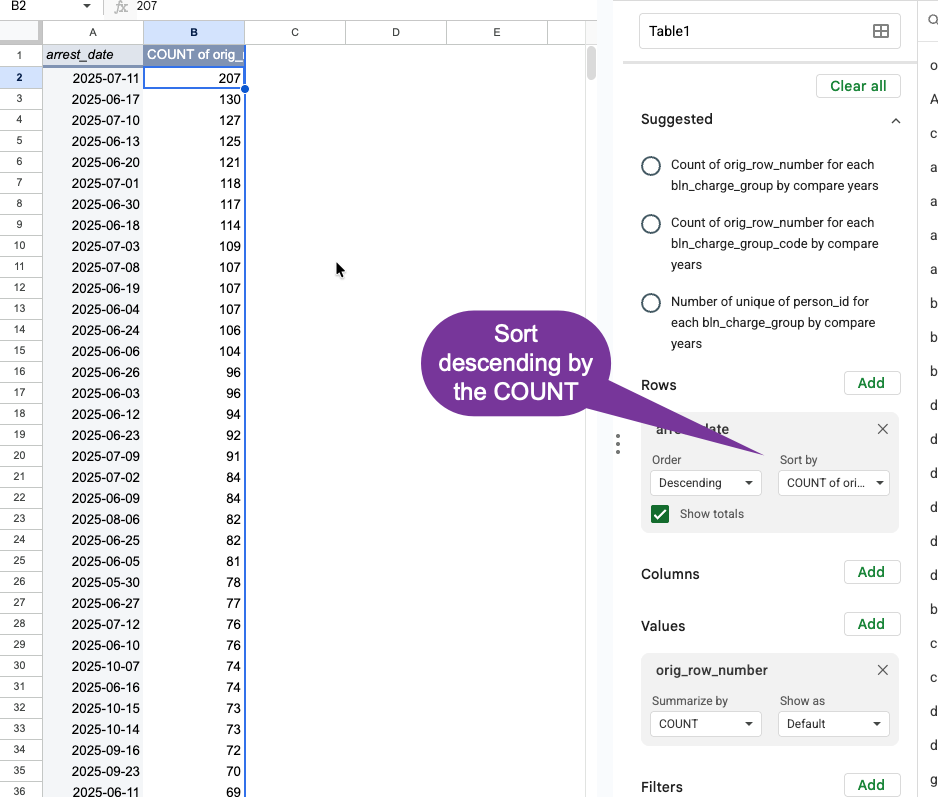{fig-alt="Biggest day is July 11" width=80%}

You've probably heard of the big raids in your area, but simply Googling the date and the region with "ICE raid" will get you pretty far: "[ICE, CBP Arrest at Least 361 Illegal Aliens During Marijuana Grow Site Operation, Rescue at Least 14 Children](https://www.dhs.gov/news/2025/07/13/ice-cbp-arrest-least-361-illegal-aliens-during-marijuana-grow-site-operation-rescue)". It gives you a place to start reporting on what happened that day if you haven't yet heard of it.  You can go back to your original data table and isolate the arrests recorded in those few days to get a better sense of what happened, and what happened to the people arrested.

#### Finding a specific event

Here is how Wikipedia describes the southeastern Georgia Hyundai auto plant last fall:

::: blockquote

On September 4, 2025, American law enforcement conducted an immigration raid at the Hyundai Motor Group Metaplant America, an electric vehicle (EV) production site in Ellabell, Bryan County, Georgia, United States, detaining approximately 475 workers. The raid was described as the largest immigration enforcement operation carried out at a single location by the United States Department of Homeland Security. The raid led to a diplomatic dispute between the United States and South Korea, with over 300 Koreans detained, and increased concerns about foreign companies investing in the United States.[4]

:::

Using filters, you can get pretty close to this:

1. There were 1,300 people arrested in Georgia during September 2025.
2. About 400 of those were logged between September 4 and September 7.
3. About 300 were detained at the Folkston D. Ray ICE processing center. Many of these are showing a detention date BEFORE the arrest by a day or two. The "landmark" arrest site is the Folkson general area, and the dates are often a day or two after the actual raid.
4. Of those, 198 were Korean or South Korean citizens, according to the data. One area of confusion is that many of them are listed as "custodial" arrests in the original data, even though we believe this was a workplace raid.
4. The vast majority of those were returned to South Korea the following week, but there were people from other nationalities included.

Looking up important events in your area will probably highlight errors in the original data as well as inaccuracies in the original news reports and press releases. Do as much street reporting as you can before quoting these data as fact.

