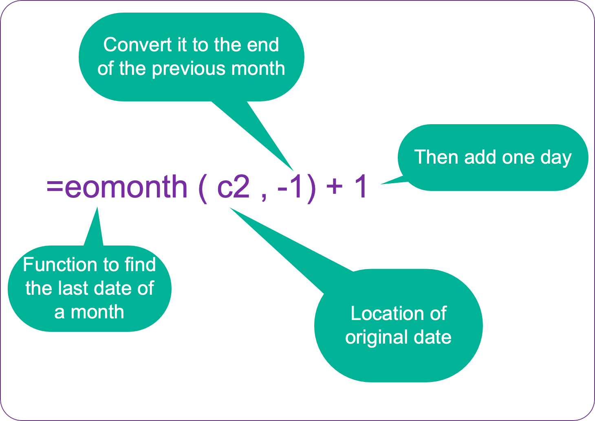

# Refining your list of arrests

Once you've downloaded your data, you may want to keep only some of the arrests in your states. Two common ways to do this are:

1. **Location of the first detention**: About 85 percent of the people arrested were booked into detention around the same time. We have recorded the first place that these arrestees were sent. There are two advantages to limiting your work to just people who were detained. First, you know what county and city the detention center was in, so you can get closer to your own area. Second, you may want to center  your story on people who were held, not everyone who was arrested.

2. **Site landmark**: These are supposed to be descriptions of the arrest location, but they are, in practice, pretty general. In some cases, such as the mass arrest of Korean workers near Atlanta in September 2025, each person's landmark is actually the location of the first detention. But in other cases, you'll see an abbreviation of a city or metro area in most of the landmark entries. You might want to use these to filter the arrests to something closer to your own area. This is kind of risky -- it's best done if you care less about exactly how many people were arrested in your area and more about what happened to them.^[[Caitlin McGlade's Github site](https://github.com/crmcglade/north-carolina-ice-arrests/tree/main) documents how she used a combination of state, detainer information and landmark to isolate arrests in and around Charolotte, NC.]

All of the examples that follow used the arrests that occurred in the Los Angeles Area of Responsibility.

## Importing your data into a Google sheet

Here is what your data might look like after you've brought it into a Google Sheet.

::: {.column-body-outset-right}

:::

Make sure to keep the `orig_row_number` column on the very left. It's important to have a column that shows you the order that the original file came in -- otherwise you can't un-sort it. (The row  number is the location in the original FOIA dataset.)

Before you go any further, convert the spreadsheet to a "data table", which will make widen all of your columns and improve the chances that all of your rows and columns will stay together as you work.

{width="85%"}

From here, you can use sequential filters to look for the OPPOSITE of what you want to keep, and delete the rows that match. For example , to keep only the arrests that led to detention in Los Angeles or San Bernadino counties, I would select everything EXCEPT them in the list, then delete the matching rows.

## Assign date categories

You will probably want to look at your data either by year, by month, or by administration. You'll need to work with the date of the arrest to customize the analysis categories.

If you want to look at the data by month, you'll need to convert the date of the arrest to the first of the month. Or you may need to create comparable time periods, such as the first 9 months of each year.

### Assign the beginning of the month and format the date

Right-click on the heading row near the arrest data, and choose `Insert 1 column to the left`. Enter a formula into the first row's empty cell by starting with an equal sign, `=`. Then type the name of the function, `eomonth`, which gives you the date of the last day of the month. The function references the date held in the next column, which is in cell `C2`, but you have get the PREVIOUS month's last date for this to work, then add one day to get the first day of that month. Here's what the full adjustment looks like:

{width=40%}

{width="85%"}

Then you can press CMD-Enter to fill it in the rest of the column.

### Get comparable 2024 and 2025 data

You could set up a complicated formula to get comparable periods for 2024 and 2025 but you can accomplish the same thing using a series of filters. Just be REALLY careful and check your work when you're done.

::: callout-note

### Pitfalls with filters

There are a lot of ways to mess up filters without realizing it. Follow these guidelines to avoid most of the errors:

1. Always start at the top row. An easy way to get there is to select the cell in the heading and then press the down arrow once.

2. Be sure that you've cleared all of the filter selections before you start. That way you don't risk filling in things you don't mean to. (Under the Filter, make sure "Clear" is selected and that no rows will be included to begin with. This is the opposite of Excel's behavior.)

3. Whenever possible, do your editing on a column to the right of a column that's always filled out. This will prevent anything you quck-copy down from stopping halfway through your data.

4. ALWAYS check your answers -- make sure there are no unexpected missing values and that the values are what you expect.

{width=40%}

:::

Insert a new column to the left of the date and choose the dropdown menu on the date column to turn on a filter. The current release of the data starts in September 2023 and ends on Oct. 15, 2025. This example sets the comparable time frames as Jan 1 to Oct 15 in both of the years that we have.

In the filter, choose the item "Filter by Condition" instead of choosing the individual dates. At the bottom of the list, choose "Is between" as your condition, and type in `2024-01-01` to `2024-10-15` in the boxes. This filters all of your rows to just those between those two dates.

Once you're sure you're at the top of the table, type in two consecutive rows of "2024", select both of those cells and double-click on the plus sign that appears at the bottom right corner of the selection:

{width="70%"}

(If you don't type in two cells, it's possible Google will think you want it to give you consecutive years, not just repeat the same year over and over.)

Repeat the process , changing 2024 to 2025 in the boxes. Again, make sure your cursor is in the first row of the table before you try to copy anything.

Finally, remove the filter on the date column by choosing "None" in the filter by condition box, then filter the new, partially filled out  column for blanks. You can fill in "Neither" to fill out the rest of the rows, though it's not strictly needed.^[It's good practice that, whenever possible, you don't leave a empty values in your table. It just makes everything else less difficult and error-prone.]

Here's what the left portion of your spreadsheet might look like after a little formatting:

Your table is ready for some analysis.

