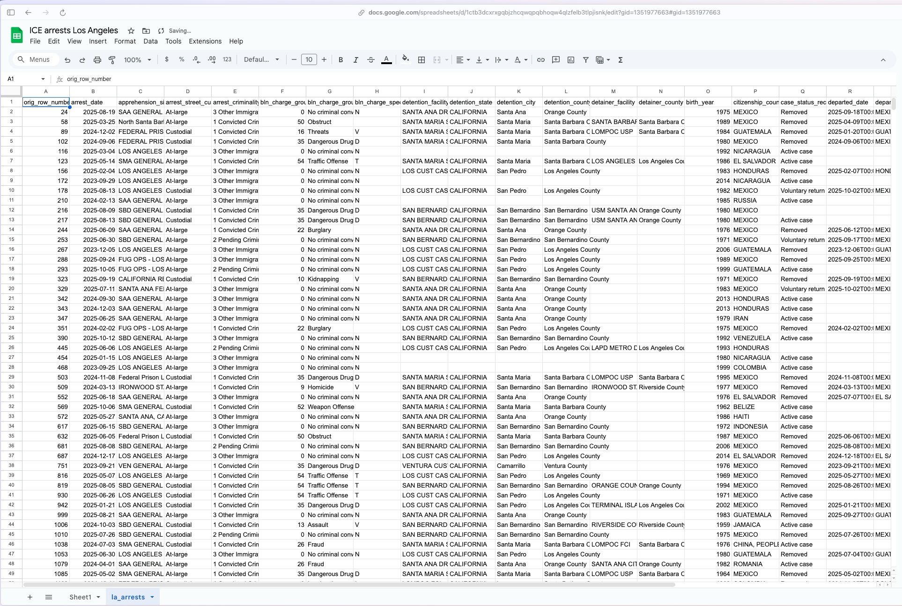
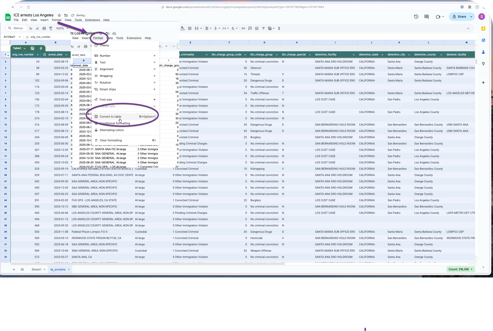
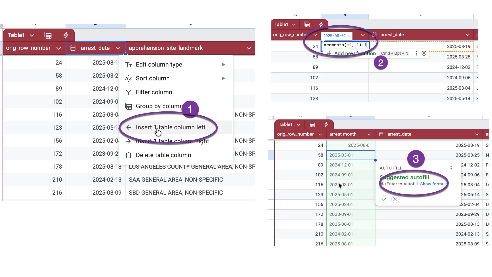
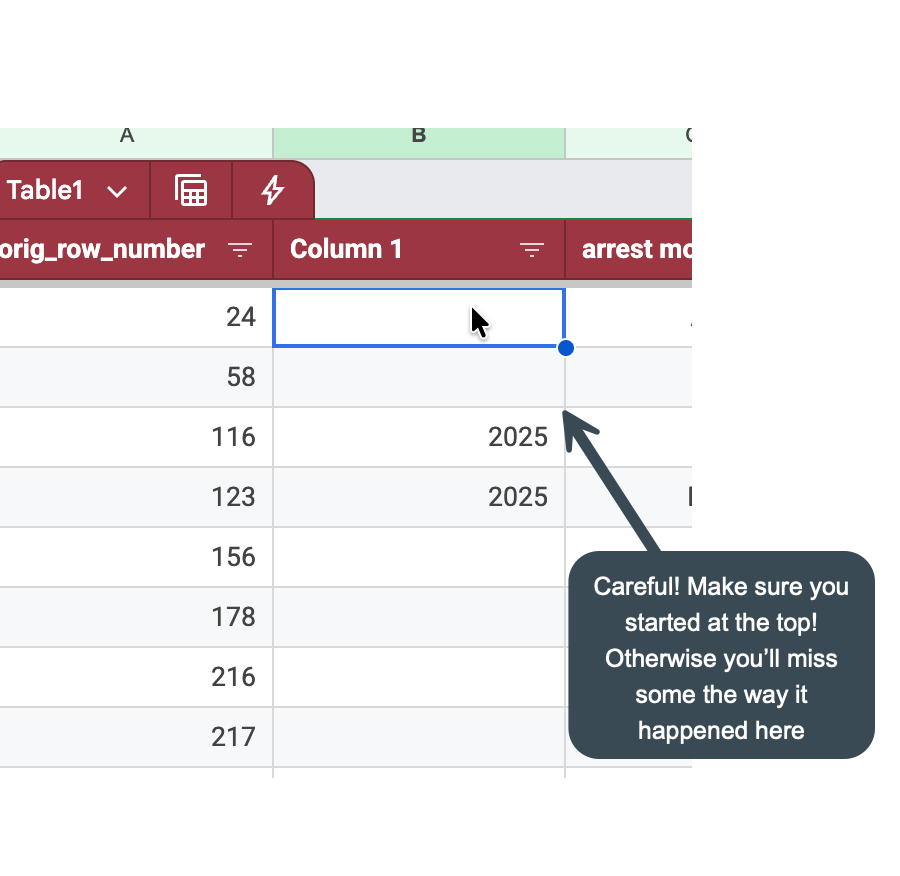
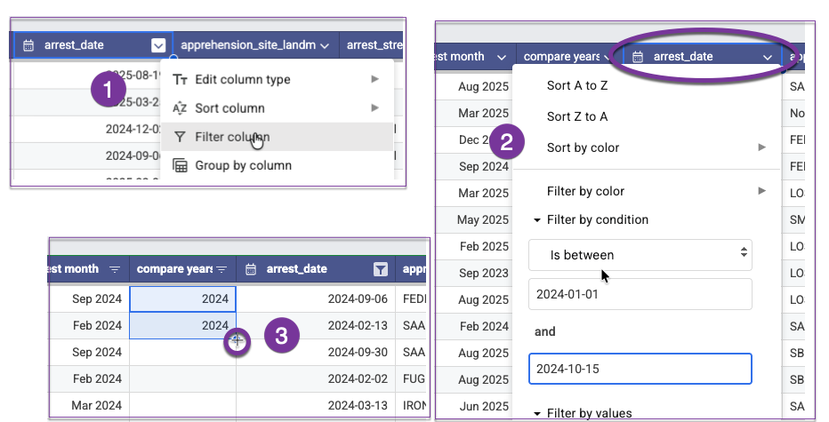
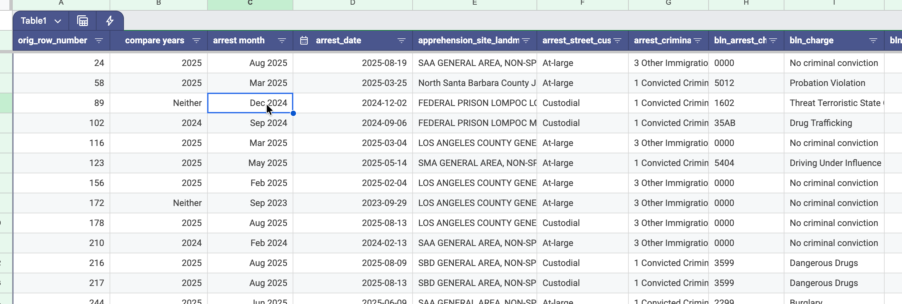

# Local arrests {#local-arrests}

The following chapters will lead you through reproducing some of the most common data-driven stories from around the country. We'll use the
stories produced by The Colorado Sun, with data anlaysis by Sandra Fish, as our guide.

## Download your local data

TK

You will have several choices on how to determine your local area, none of which are perfect:

1. BLN estimated state of arrest: BLN has backfilled the missing states in the original data based on either the location of detainers or the first detention location. It's possible these are wrong, but it's better than ignoring the missing states altogether.^[If you were to download the original data with about 10 percent of the rows missing a state of arrest before mid-2025, you would overestimate the growth in arrests under President Trump. Don't do this.]

2. Location of the first detention: About 85 percent of people arrested are booked into a detention center within a week of the arrest. This is pretty consistent across the Biden and Trump administrations. There's one argument that you care more about this subset of people, as they are the ones who may be removed or imprisoned. It's also more precise than the state -- you know just where the detention facility is. This is how the New York Times estimated the county of arrest in its stories.^[People who accepted the government's offer to buy a plane ticket home may not be included in these detentions.]

3. Area of Responsbility: In some cases, the ICE Enforcement office that is responsible for the arrest is MORE specific than the state, such as Los Angeles, Dallas, and New York City. For these major immigration hubs, you can just search for that area of responsibility.

{fig-align="center" width="50%"}

4. Site landmark: These are supposed to be descriptions of the arrest location, but they are, in practice, pretty general. In some cases, such as the mass arrest of Korean workers near Atlanta in September 2025, each person's landmark is actually the location of the first detention. But in other cases, you'll see an abbreviation of a city or metro area in most of the landmark entries. We suggest using these entries as a way to refine your search rather than as a way to start it.^[Caitlin McGlade's Github site](https://github.com/crmcglade/north-carolina-ice-arrests/tree/main) documents how she used a combination of state, detainer information and landmark to isolate arrests in and around Charolotte, NC.]

## Importing your data into a Google sheet

Here is what your data might look like after you've brought it into a Google Sheet.

{width="80%"}

Make sure to keep the `orig_row_number` column on the very left. It's important to have a column that shows you the order that the original file came in, and have a way to un-sort it. (This row number is the order in the orginal, national, file).

Before you go any further, convert the spreadsheet to a "data table", which will make widen all of your columns and improve the chances that all of your rows and columns will stay together as you work.

{width="85%"}

## Assign date categories

If you want to look at the data by month, you'll need to convert the date of the arrest to the first of the month. If you want to look at it for comparable periods over 2024 and 2025, as the Colorado Sun did, you'll need to assign those. Here's how to take two different approaches to doing that.

### Assign the beginning of the month and format the date

Right-click on the heading row near the arrest data, and choose `Insert 1 column to the left`. You'll enter a formula into this column. Every formula starts with an equal sign `=`, and then the name of a command, or function. The function to use here is `eomonth`, which gives you the date as of the end of a month. We have to adjust it so that it gives us the BEGINNING of the month instead:

{width="85%"}

Hit Cmd-Enter to fill in the formula for the entire column of the table.

### Get comparable 2024 and 2025 data

In this case, you could set up a complicated formula, but it's worth getting used to setting some values by using one filter after another. Just be REALLY careful.

::: callout-info
## Pitfalls with filters

Here are the things you have to be super careful to do when you edit with filters:

1. Always start at the top row. An easy way to get there is to select a cell within a column that's always filled out (in this case, both the date and the original row ID's area always filled out), and then press CMD-up. That takes you back to the column heading. (You could also select the heading cell, then hit the down arrow once.)

2. Be sure that you've cleared all of the filter selections before you start. That way you don't risk filling in things you don't mean to.

3. Whenever possible, do your editing on a column TO THE RIGHT of a column that's always filled out. This will prevent anything you quck-copy down from stopping halfway through your data.

4. ALWAYS check your answers -- make sure there are no unexpected missing values and that the values are what you expect.

:::: {layout="[ 40, 60 ] " layout-valign="center"}

::::: {style="padding-left: 2rem; align-items: center;"}
Here's what happens if you start editing a filtered list without starting at the top: You will miss filling out anything that's above the row you started in!
:::::

::::: {#second-column}
{width=80% }
:::::

::::

:::

Create another new column to the left of the date, and choose the dropdown menu on the date column to turn on a filter. Right now, the data runs from around September 2023 through Oct. 15, 2025. This example sets the comparable time frames as Jan 1 to Oct 15 in both of the years that we have.

In the filter, choose the item "Filter by Condition" instead of choosing the individual dates. At the bottom of the list, choose "Is between" as
your condition, and type in `2024-01-01` to `2024-10-15` in the boxes. This filters all of your rows to just those between those two dates.
Once you're sure you're at the top of the table, type in two consecutive rows of "2024", select both of those cells and double-click on the plus
sign that appears at the bottom right corner of the selection:

{width="70%"}

(If you don't type in two cells, it's possible Google will think you want it to give you consecutive years, not just repeat the same year
over and over.)

Repeat the process , changing 2024 to 2025 in the boxes. Again, make sure your cursor is in the first row of the table before you try to copy
anything.

Finally, remove the filter on the date column by choosing "None" in the filter by condition box, then filter the new, partially filled out
column for blanks. You can fill in "Neither" to fill out the rest of the rows, though it's not strictly needed.^[It's good practice that, whenever possible, you don't leave a empty values in your table. It just makes everything else more difficult and error-prone.]

Here's what the left portion of your spreadsheet might look like after a little formatting:

