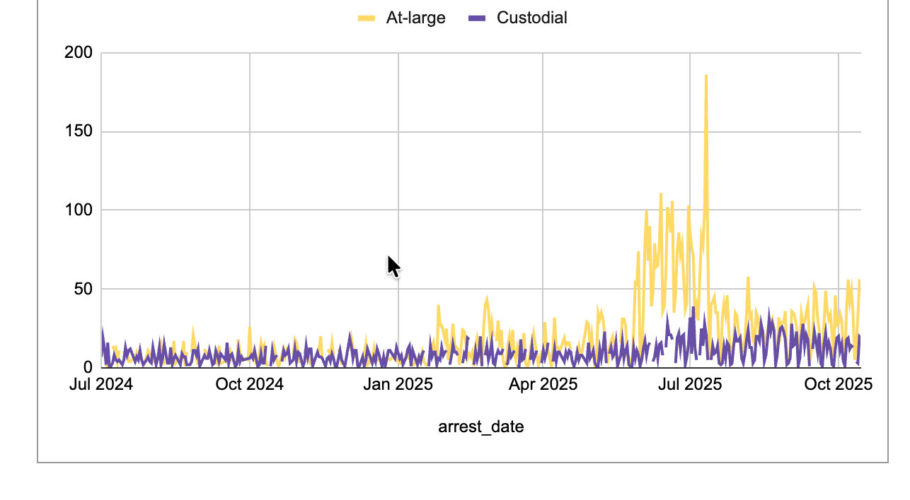

# Profiling the arrest data

This section reviews particular passages in stories and studies that you can replicate in your own area. It assumes you have taken the first steps, outlined in the previous chapter, to download and organize the records you want to use in your analysis.

The pieces include:

* The Deportation Data Projects analysis, "[Immigration Enforcement in the First Nine Months of the Second Trump Administration](https://deportationdata.org/analysis/immigration-enforcement-first-nine-months-trump.html)", by Graeme Blair and David Hausman

* The Colorado Sun's coverage of the criminal records of people arrested and a deep dive into the profile of arrests in their area:  "[Ice arrested more thatn 3,500 people in Colorado in 2025 - including babies and the elderly](https://coloradosun.com/2025/12/31/ice-arrests-2025-data-deportation-data-project/)," by Taylor Dolven and Sandra Fish an earlier story on the [criminal histories in Colorado and Wyoming](https://coloradosun.com/2025/07/18/ice-arrests-colorado-wyoming-no-criminal-history/), published with WyomingFile.

{width=75% fig-align="center"}

* The Washington Post's [comprehensive view of street arrests](https://wapo.st/46wte1r) (gift link), which go back to 2008. This analysis will be a shortened version of it, but the growth in "at-large" arrests is one of the most visible pieces of the enforcement surges.

We recommend reviewing each of these pieces when you're analyzing your own area. Substantial differences in trends could suggest either an error in the data or the analysis, or could suggest newsworthiness. Only you can tell the difference.

These analyses relies on three elements:

* Recoding data into the exact categories you need, such as the timing categories shown in the last chapter.
* Possibly filtering the data to remove items you don't want to see. If you find yourself always filtering for the same thing, consider making a copy of just the rows you want to include.
* Creating one- or two-way pivot tables, with percentages.

## Criminal histories

The New York Times, Stateline and the Colorado Sun have gone beyond knowing that most people arrested in 2025 lacked a known criminal conviction. They also looked at the charges and the proportion that were violent. The BLN data slice provides the "charge group", which is a general categorization for major crime types such as homicide, assault, traffic offenses and drugs.^[Although there is a difference in the detail coding between drug possession and sale, the actual data usually lumps it all together into "Dangerous Drugs". We're not trying to split them out here.]

Here's what the Colorado Sun and WyomingFile said, based on data through July 2025 :

::: blockquote

Most people arrested by U.S. Immigration and Customs Enforcement agents between Jan. 20 and June 26 of this year in Colorado and Wyoming did not have any criminal convictions, according to ICE data released over the last few weeks. Among those arrested who had a conviction at the time of their arrest, the most serious crime is most often noted by ICE as drunken driving.^[This analysis will use traffic violations rather than the detailed drunken driving specification] in both Colorado and Wyoming, the data shows.

:::

There are three ways to look at criminal histories, and each depends a little on rejiggering the data to meet your needs. Whether or not a person had a criminal conviction at the time of apprehension is listed in the arrests table, but the details of those charges are only found elsewhere in the ICE data. The BLN data matches the most recent "most serious criminal conviction" from the detention table to arrests.

### Criminality at the time of apprehension:

Create a pivot table of the column called `arrest_criminality`:

{width=80%}

("Other immigration violator" is the way that ICE says that someone has no pending charges or convictions -- they contend that everyone they arrest is an immigration violator.)

While not exactly the same, these numbers for the Los Angeles area are in rough agreement with the data from elsewhere, including the Colorado story. It suggests that ICE thinks there are pending criminal charges against many more immigrants in the previous year, but many fewer have actual convictions.

Breaking out the different administrations (either by looking at monthly trends or comparing like portions of years) can change the interpretation a lot! In this case, a majority of arrests were of people with criminal convictions since 2023, but the 2025 data shows a much different pattern.

### Violent criminal history

BLN has added a "special" code to the data, referring to special categories of criminal convictions. Here's what they look like for the Los Angeles area when combined with the criminality code:

{fig-alt="Criminality by type of crime" width=80%}

This shows the proportion of arrests with violent criminal histories has fallen, to 11 percent, in the Los Angeles area.

### Most frequent charges

The Colorado Sun / WyomingFile data through June surprisingly showed that the most frequent charge was drunken driving. Here's what the charges look like in Los Angeles, through Oct. 15. (Note that the Filters section is used instead of comparing the two periods in this chart.)

{fig-alt="Most common crime charge in LA is drug trafficking followed by DUI" width=80%}

BLN has also created a column called `bln_charge_group`, which combines crimes based on their standard FBI codes into more general groupings. For instance, all homicides are grouped together instead of being broken out by a specific type. Here's a portion of the Los Angeles data showing the different crime categories :

{width=90%}

## Custodial vs. street arrests

Street arrests are considered any  arrest made that was not part of a transfer from a detention center, jail or prison. One marked difference from previous years is that ICE is making many more of these arrests as shown in this weekly chart from the DDP paper.

{width=80% fig-align="center"}

Here's what a similar chart of the Los Angeles data would look like, based on a pivot table by month^[The DDP uses only data for arrests that resulted in a detention, which is why its headings are a little different]:

The overall number of arrests didn't increase as much, partly because California does not honor the detainers that lead to custodial arrests. But the spike in at-large, or street arrests, is noticeable during the surge over the summer of 2025 in Southern California.

::: callout-warning

## People vs. arrest counts

People are duplicated in the arrest data when they appear to have been arrested more than once. You can handle this in several ways. The easiest is to make sure you are careful with your language, and write about "arrests" rather than "people" counts.

But if you want to make sure you're not double-counting anyone, you can use the `bln_person_id` as a way to count "unique" values. This makes sure no one is counted twice in the same sentence, but can lead to confusing totals -- the number of "people arrested" will differ between the total, the total for a year, or the total for a month.

Here's how you would avoid double-counting people, and how it changes the totals:

:::

## Countries and ages

Here's what the Colorado Sun wrote about the youngest person arrested since January 2025:

::: blockquote

Among the youngest people arrested in Colorado was a baby girl born in 2024, the data shows, with Mexican citizenship. ICE arrested her July 30 in the Denver area and deported her Aug. 8 to Venezuela, according to the data.

:::

Here's how you might find the same thing for your area:

1. Filter for dates since Jan. 20, 2025
2. Sort the table by birth year, in descending order
3. Look across the table to see what happened to that toddler

Here, the  youngest is a Mexican boy born in 2023, arrested on January 28 and removed the next day to Honduras, according to the data.

You can reverse the sorting and filter for "No criminal conviction" to find the oldest person without a criminal conviction - a Mexican man in his late 70s, arrested in public in September, who left voluntarily on the same day.

Consider filtering by country if you are interested in people from a particular country -- say, Venezuela.

You might consider removing all filters anytime you start a new analysis -- it's easy to get confused about what, exactly, you're looking at in a large spreadsheet. Choose the menu item Data -> Remove Filter to begin, then re-set your filter for arrests since Jan. 20.

When you filter, the bottom right corner will display how many arrests are included in your current view. Save this view for the future by choosing the menu item Data, Save as Filter View, and give it a name:

When you close that view, the filter is turned off and you can start over.

## Where to go from here

You may have heard of arrests at a specific spot in your area. Consider looking for these in the arrest data, then following up with whatever you can find using your usual reporting methods. That's what the Colorado Sun did, in order to get this lede:

::: blockquote

On just one Sunday in April, immigration officers arrested at least 72 people in Colorado, data from U.S. Immigration and Customs Enforcement shows, the busiest day for immigration enforcement in the state so far since President Donald Trump took office in January.

That day, federal agents from several agencies raided a Colorado Springs nightclub, arresting dozens of people they suspected of being in the country illegally.

“Colorado Springs is waking up to a safer community today,” Jonathan Pullen, special agent in charge of the U.S. Drug Enforcement Administration’s Rocky Mountain Division, said after the raid.

But newly released data shows that just nine of the 72 people ICE agents arrested in Colorado that day were marked by the agency as having any prior criminal convictions. ICE said the convictions were for a traffic offense, obstruction, assault, illegal entry, driving under the influence, heroin smuggling and marijuana possession.

:::

The story went on to provide more details on the people caught in that raid before turning to a statistical analysis of the arrest data.

