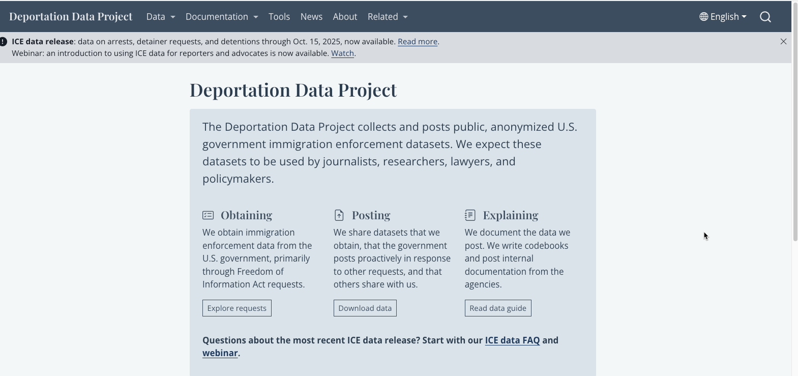
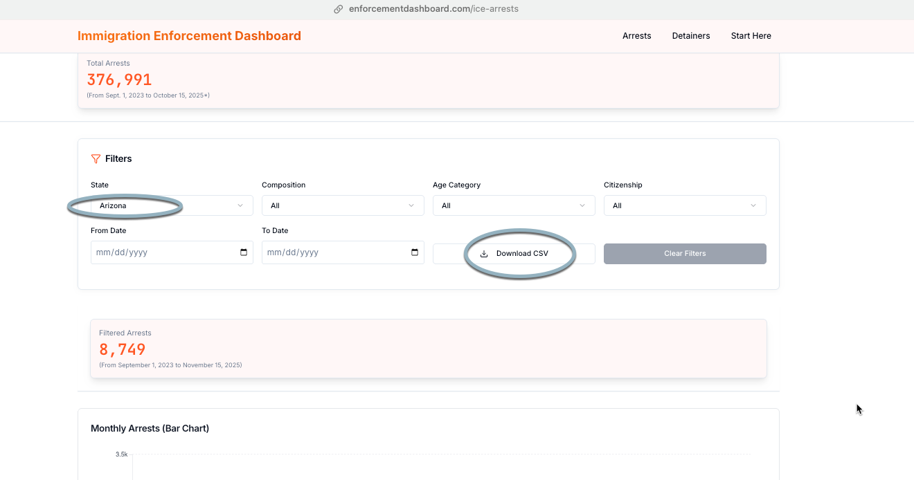
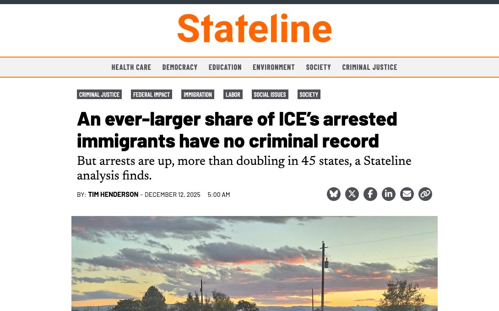

# The Deportation Data Project

The [Deportation Data Project](https://deportationdata.org) is the most widely used effort at documenting arrests, detentions and removals in the immigration system.  The project is run by [Graeme Blair](https://graemeblair.com/), a political scientist at UCLA, and David Hausman, a professor at UC Berkeley Law. For years, they and their lawyers have been suing Homeland Security and its agencies for useful individual-level data on immigration enforcement datasets. They make the results of that effort available to anyone. 

The project is actively updating information from Immigration and Customs Enforcement, or ICE.^[Customs and Border Patrol, or CBP, has not yet provided data that is compatible with the ICE data, and the immigration courts run by the Justice Department provide completely different datasets, which haven't yet been analyzed or cleaned by the project.]  As of this writing, the it posts some of the original FOIA data through Oct. 15, 2025. It is trying to get the agency to correct recent versions of the remaining tables.

Each update to the data generally requires another lawsuit by the project, which means there is no standard release schedule even though the courts have told ICE to produce the files.

There are nearly than 375,000 apprehensions representing about 300,000 people in the arrest data alone. Detentions -- people held in ICE facilities -- cover about 1.6 individual steps in the system, as the federal government moves people from place to place.

Along with raw data files shared by the project, it has also created filters that let users take smaller cuts. All of these are well documented on the website: 

* [arrests](https://deportationdata-ice-arrests.share.connect.posit.cloud/) ,  
* [detention stays](https://deportationdata-ice-detention-stays.share.connect.posit.cloud/)  
* [detainer requests](https://deportationdata-ice-detainers.share.connect.posit.cloud/), and 
* [daily population counts for every detention facility](https://deportationdata-ice-detention-facilities-daily-population.share.connect.posit.cloud/)

## Other sources

Before delving into the detailed data yourself, consider whether one of the other organizations working with the ICE dataset might have something simple you can use instead: 

### Relevant Research

[Relevant Research](https://relevant-research.com/work) aims to help academics analyze data for their work. The company is led by Austin Kocher, a Syracuse University researcher, and Adam Sawyer, formerly of the Transaction Records Access Clearinghouse, or TRAC.^[TRAC filed the original lawsuit against DHS in the early 2000's, and has continued to fight for more transparency. It also provides some analysis of immigration court and ICE statistics, most of which is for paid clients.]  Kocher [often provides additional datasets on his Substack](https://austinkocher.substack.com/p/live-breakdown-of-new-immigration), such as his state-by-state arrest trends produced during his his initial review of the December 2 release of ICE data by DDP.

The [immigration enforcement dashboard](https://enforcementdashboard.com/) provides summary data on arrests and detainers, which you can filter by state. It lets you download monthly totals for your filtered data. The detainer data on that site can also be filtered by state, and lists the 10 most common facilities that have detainers from ICE.

{width=80%}

Another site by Relevant Research is its ongoing [analysis of detention facilities](https://detentionreports.com/) owned and operated by ICE. This compiles the history of facility-level statistics published by ICE for its own detention facilities. (It's a small subset of the locations used to house immigrants.)

### Vera Institute Detention trends

The Vera Institute provides [analysis of each detention facility](https://www.vera.org/ice-detention-trends) owned, operated or contracted by ICE. It has put together data going back to 2008 on detention by location, which it lets you [download from its Github site](https://github.com/vera-institute/ice-detention-trends/tree/main/facilities/by_state) by state. This original data was used as the source for BLN's enhanced detention locations.

### Stateline.org analysis

Tim Henderson at Stateline.org is often the source of local reporters' arrest analyses -- [his stories after each of the data releases](https://stateline.org/2025/12/12/an-ever-larger-share-of-ices-arrested-immigrants-have-no-criminal-record/) are accompanied by a downloadable dataset that went into the analysis.

{width=60% fig-align=center}

### Transactional Records Access Clearinghouse (TRAC)

TRAC has been collecting, analyzing and posting data from the [immigrations courts](https://tracreports.org/immigration/quickfacts/eoir.html) for almost 20 years. It was the first to acquire the monthly release of detailed individual records from the immigration court dockets, which is released each month on the Justice Department's [Executive Office of Immigration Review website (under EOIR Case Data)](https://www.justice.gov/eoir/foia-library-0). Its website is hard to use -- consider calling them if you have specific questions.^[BLN plans to work on making this data more accessible in the future.]

### Government FOIA sites

Customs and Border Patrol posts individual-level apprehensions on its [FOIA website](https://www.cbp.gov/document/foia-record/customs-and-border-protection-border-patrol-statistics)^[The sort function on the dates doesn't work, but look for recent releases titled "USBP Nationwide Apprehensions"], but these do not include any indication of where the arrest happened, and do not have identifiers for individuals. They're really only useful for national level analysis of arrests by country of origin and some indication of how many people were removed vs. turned over to ICE.

ICE's own [FOIA site](https://www.ice.gov/foia/library) contain some information on contracts with detention facilities, but not much else of use. Most of these are really old, even when they have been posted recently. They are in response to a 2021 appropriations law requiring DHS to provide details on sole source contracts.

