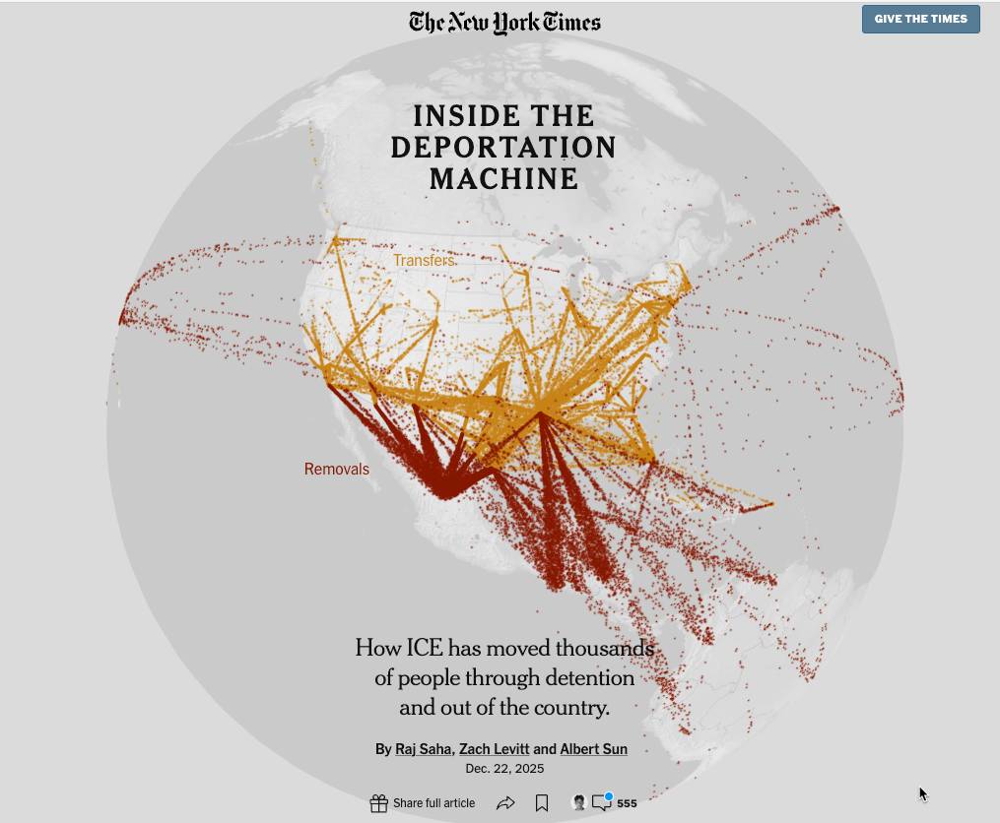
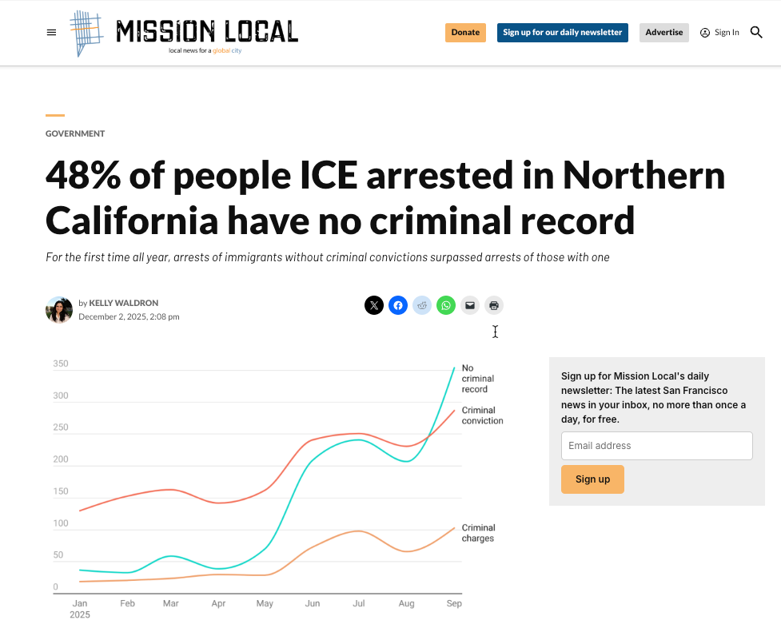
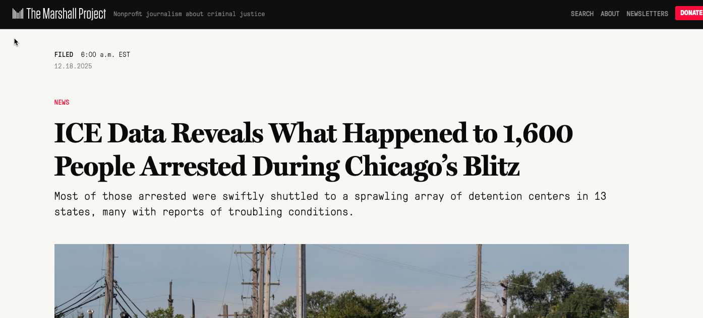

# Stories from the Deportation Data Project

In December, a team at the New York Times [delved into what it called the "deportation machine"](https://www.nytimes.com/interactive/2025/12/22/us/trump-immigration-deportation-network-ice-arrests.html?unlocked_article_code=1.DVA.BljE.PpyxS9ZrBN4V&smid=url-share) (gift link), analyzing data from the Deportation Data Project to show how immigrants were moved around the country and eventually deported.

It followed a [piece earlier in the month](https://www.nytimes.com/interactive/2025/12/04/us/ice-arrests-criminal-records-data.html?unlocked_article_code=1.7E8.on5I.OSUqiHl8kSYW&smid=url-share) in which Albert Sun found that few of the people arrested in cities that experienced crackdowns over the summer and fall had violent crimes in their histories.

{width=90%}

Large national newsrooms aren't the only ones to have analyzed data for stories about the system. Similar stories come from places like [Texas](https://www.texastribune.org/2025/11/03/texas-trump-immigration-crackdown-ice-arrests-deportation/), [Charlotte](https://www.charlotteobserver.com/news/local/article313429082.html?giftCode=b52ab5c24c1574d6fb77ce72c4c110c6b98e3ce4c1bce1bba44b98bae3bf3a73) (gift link) and [Los Angeles](https://www.latimes.com/california/story/2025-07-16/ice-arrests-accelerate-socal-june) -- along with smaller jurisdictions like [Mission Local](https://missionlocal.org/2025/12/sf-ice-arrests-criminal-history/)'s coverage in Northern California and the [Idaho Capital Sun](https://idahocapitalsun.com/2025/08/04/ice-arrests-and-detentions-rise-steeply-in-idaho/).

{width=65% fig-align=center}

Instead of looking at arrests, The Guardian had a different question: How often was the ICE keeping detainees in holding facilities meant for stays less than 12 hours? It found that these 170 short-term holding facilities around the country routinely violated the original 12-hour limit, and [some violated a new limit of three days](https://www.theguardian.com/us-news/2025/oct/30/ice-hidden-detention-sites).

Other reporters have been able to tease out patterns of particular importance in their areas, such as [The City's analysis](https://www.thecity.nyc/2025/08/11/26-federal-plaza-immigration-court-trump-arrests-data-analysis/), with researcher James Gunther, of people arrested on their way out of the New York City immigration courthouse. The  [Chicago Tribune analyzed book-ins (Internet Archive capture)](https://www.chicagotribune.com/2025/12/01/operation-midway-blitz-criminal-record/) at local processing facilities during the Midway Blitz late in 2025 to encompass arrests by agencies other than ICE.

Some stories have focused on local law enforcement's cooperation with ICE, such as [Suncoast Searchlight's analysis of detainers](https://suncoastsearchlight.org/the-tally-ice-detainers-in-florida/) in Florida, or the University of Maryland's Howard Center stories on [a few rural sheriffs](https://cnsmaryland.org/2025/11/13/marylands-surprising-role-in-implementing-trumps-immigration-agenda/) becoming responsible for many of the arrests across the state.

And the Marshall Project wanted to know what happened to people after they were arrested. Their analysis followed 1,600 people arrested during the Midway Blitz in Chicago through the sprawling detention system nationwide.

{width=80% fig-align=center}

The pages that follow lay out how you can do stories like this in your area using the data and advice from the reporters.

If you need more inspiration, [scroll through the stories](https://deportationdata.org/news.html) at the DDP site -- and send them links to your own stories when you publish.

